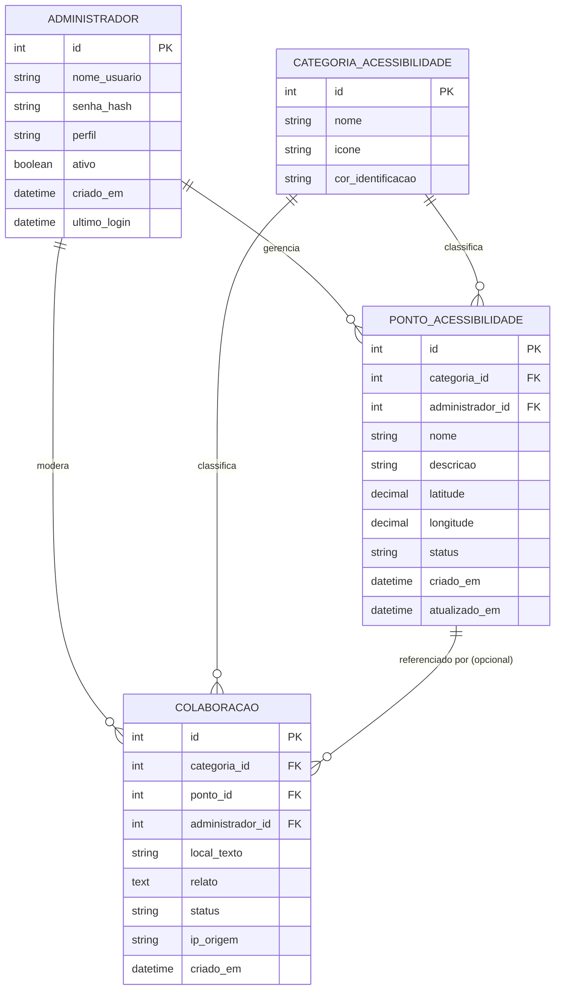
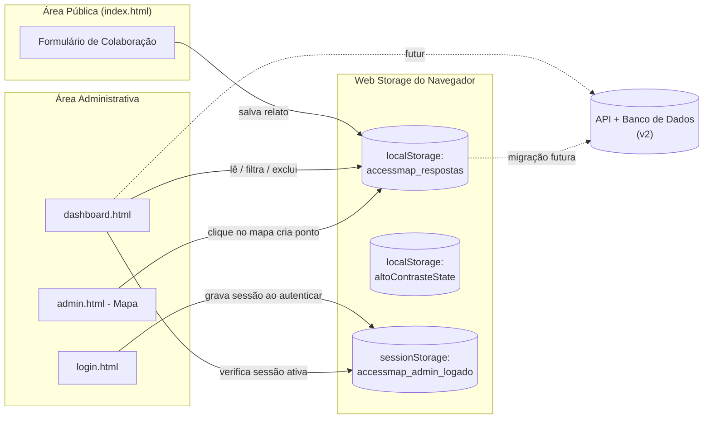

# AccessMap

**Mapeamento colaborativo de acessibilidade em espaços públicos**

> Projeto de Extensão — Tecnologia em Sistemas para Internet
> IFSP Campus Itapetininga — 2026/2027

---

## Sumário

- [Sobre o Projeto](#sobre-o-projeto)
- [Motivação](#motivação)
- [Impacto e Gestão Pública](#impacto-e-gestão-pública)
- [Funcionalidades](#funcionalidades)
- [Tecnologias Utilizadas](#tecnologias-utilizadas)
- [Estrutura do Projeto](#estrutura-do-projeto)
- [Arquitetura da Versão Atual (v1 — sem banco de dados)](#arquitetura-da-versão-atual-v1--sem-banco-de-dados)
- [Modelo de Dados](#modelo-de-dados)
  - [Visão Geral das Entidades](#visão-geral-das-entidades)
  - [Diagrama Entidade-Relacionamento](#diagrama-entidade-relacionamento)
  - [Dicionário de Dados](#dicionário-de-dados)
  - [Migração para Banco de Dados Real](#migração-para-banco-de-dados-real)
- [Fluxos do Sistema](#fluxos-do-sistema)
- [Acesso Administrativo (Ambiente de Avaliação)](#acesso-administrativo-ambiente-de-avaliação)
- [Como Executar Localmente](#como-executar-localmente)
- [Acessibilidade](#acessibilidade)
- [Roadmap](#roadmap)
- [Autoria e Desenvolvimento](#autoria-e-desenvolvimento)
- [Licença](#licença)

---

## Sobre o Projeto

O **AccessMap** é um projeto de extensão que visa mapear e catalogar pontos de acessibilidade dentro do **campus do IFSP Itapetininga**, promovendo a inclusão em sua forma mais ampla. Esta primeira versão do sistema foi pensada, modelada e implementada especificamente para a realidade do campus, servindo como piloto para validar a proposta.

Esta iniciativa surge da necessidade de oferecer suporte e orientação a alunos, servidores e visitantes. O campus recebe pessoas em contextos variados — do dia a dia letivo a eventos de grande porte que atraem públicos diversos — e ter um suporte de acessibilidade claro é essencial para garantir que todos tenham uma experiência inclusiva e autônoma no espaço.

O objetivo central vai além de facilitar a locomoção física: o AccessMap também contempla o suporte a dificuldades auditivas e visuais, unindo mapeamento geográfico, categorização de barreiras e um canal aberto de comunicação com a comunidade.

Embora o foco atual do projeto seja exclusivamente o campus do IFSP Itapetininga, pretende-se futuramente avaliar uma versão adaptável do AccessMap para outros espaços públicos, conforme detalhado no [Roadmap](#roadmap).

## Motivação

Espaços públicos — sejam eles instituições de ensino, órgãos públicos, parques ou centros culturais — frequentemente carecem de informação estruturada sobre suas condições de acessibilidade. Rampas mal sinalizadas, ausência de recursos para pessoas com deficiência auditiva, falta de rotas alternativas: tudo isso poderia ser mapeado e comunicado de forma simples, colaborativa e visual.

O AccessMap nasce dessa lacuna, propondo uma ferramenta que:

1. **Informa** — apresenta um mapa navegável com pontos de acessibilidade já identificados no campus;
2. **Escuta** — permite que qualquer visitante relate barreiras ou sugira melhorias, sem necessidade de cadastro;
3. **Organiza** — centraliza esses relatos em um painel administrativo, permitindo à gestão do campus priorizar ações.

## Impacto e Gestão Pública

Os dados coletados pelo AccessMap possuem um papel importante para a comunidade e para a gestão do campus:

- **Mapeamento de Necessidades** — identificação real do que precisa ser melhorado, a partir da voz de quem utiliza o espaço no dia a dia.
- **Propostas de Melhoria** — as informações coletadas podem ser estruturadas em relatórios para fundamentar pedidos de verba, emendas parlamentares ou projetos de captação de recursos.
- **Transparência** — demonstração clara e baseada em dados de onde os investimentos em infraestrutura inclusiva devem ser priorizados.

## Funcionalidades

### Área Pública (sem necessidade de login)

- Página inicial institucional com carrossel informativo, seção de estatísticas e apresentação do projeto.
- Mapa interativo do campus, com possibilidade futura de marcadores por categoria de acessibilidade.
- Formulário de colaboração, no qual qualquer visitante pode relatar um problema ou sugerir uma melhoria, informando:
  - Local da ocorrência;
  - Categoria de acessibilidade (física ou auditiva, com plano de expansão para outras categorias);
  - Relato ou sugestão em texto livre.
- Widget de acessibilidade nativo (aumento/diminuição de fonte e alto contraste) e integração com o **VLibras**, tradutor de Libras do Governo Federal.

### Área Administrativa (restrita, mediante login)

Levantada na Fase 1 do cronograma do projeto, a área administrativa deve atender aos seguintes requisitos:

- O sistema deve exibir uma tela de dashboard com fácil visualização dos dados, contendo barra de rolagem e filtro de respostas para melhorar a usabilidade do administrador;
- O sistema deve permitir que o administrador acesse o mapa em modo administrativo a partir dessa mesma tela;
- O sistema deve permitir que o administrador edite os locais já cadastrados no campus, considerando eventuais alterações físicas do espaço;
- O sistema deve permitir que o administrador remova locais já pontuados no mapa;
- O sistema deve permitir que o administrador adicione novos locais na planta atual do campus apenas por meio de um clique no ponto desejado dentro do mapa;
- O sistema deve garantir uma experiência intuitiva para o administrador ao longo de todo o fluxo administrativo;
- O sistema deve permitir que o administrador organize e exclua as respostas recebidas pelo formulário principal de feedback, de modo a manter esse fluxo de respostas mais claro e gerenciável.

Nesta versão, os requisitos acima estão implementados da seguinte forma:

- Autenticação de administrador.
- Dashboard de respostas coletadas pelo formulário público, com:
  - Filtro por local;
  - Filtro por categoria de acessibilidade;
  - Busca por palavra-chave no relato;
  - Ordenação (mais recentes, mais antigos, ordem alfabética por local);
  - Exclusão de respostas já tratadas.
- Edição de pontos do mapa (`admin.html`), incluindo a inserção de novos pontos por clique direto sobre o mapa, com captura automática de latitude e longitude.

## Tecnologias Utilizadas

| Camada | Tecnologia | Finalidade |
|---|---|---|
| Estrutura | **HTML5** | Marcação semântica e acessível |
| Estilo | **SASS (SCSS)** | Estilização avançada, arquitetura modular e design responsivo |
| Interatividade | **JavaScript (Vanilla)** | Carrossel, menus, autenticação, formulário, dashboard, interação com o mapa |
| Persistência (atual) | **Web Storage API** (`localStorage` / `sessionStorage`) | Simulação de banco de dados no navegador enquanto não há back-end |
| Ícones | **Font Awesome 6** | Iconografia da interface |
| Acessibilidade | **VLibras** (Governo Federal) | Tradução de conteúdo para Libras |
| Mapas | **Leaflet** | Visualização geográfica interativa do campus |

> A escolha por manter a v1 inteiramente funcional no front-end, sem depender de um back-end ou banco de dados, foi proposital: garante que a aplicação possa ser avaliada, testada e demonstrada em qualquer navegador, sem necessidade de infraestrutura de servidor.

## Estrutura do Projeto

```
accessmap-ifsp/
├── assets/
│   ├── css/
│   │   └── style.css          # CSS compilado a partir do SCSS
│   ├── images/                # Logos, ícones, fotos da equipe, slides
│   └── js/
│       ├── script.js          # Menu, carrossel, acessibilidade, formulário público
│       ├── authentication.js  # Autenticação do administrador
│       ├── dashboard.js       # Leitura/filtro/exclusão de respostas no painel
│       └── mapa.js            # Busca, navegação e clique para cadastro de pontos no mapa
├── index.html                 # Página institucional / pública
├── login.html                 # Login exclusivo do administrador
├── dashboard.html              # Painel administrativo (protegido)
├── admin.html                  # Edição de pontos do mapa (protegido)
├── mapa.html                    # Mapa interativo do campus
├── README.md
└── LICENSE
```

## Arquitetura da Versão Atual (v1 — sem banco de dados)

Como o projeto ainda não possui um back-end, toda a "persistência de dados" da v1 é feita através da **Web Storage API** do próprio navegador, o que permite que o sistema funcione de ponta a ponta — captação de relatos, login administrativo, cadastro de pontos no mapa e visualização no dashboard — sem depender de servidor.

| Mecanismo | Uso no AccessMap | Escopo |
|---|---|---|
| `sessionStorage` | Guarda o estado de sessão do administrador logado (`accessmap_admin_logado`) | Expira ao fechar o navegador |
| `localStorage` | Guarda as colaborações enviadas pelo formulário público (`accessmap_respostas`) e a preferência de alto contraste (`altoContrasteState`) | Persiste entre sessões, no mesmo navegador/dispositivo |

Essa abordagem tem uma limitação intencional e conhecida: os dados ficam restritos ao navegador/dispositivo em que foram inseridos, não sendo compartilhados entre diferentes usuários ou máquinas. Isso é aceitável para fins de demonstração e avaliação acadêmica da v1, mas será substituído por um back-end real (API + banco de dados) nas próximas versões — ver [Migração para Banco de Dados Real](#migração-para-banco-de-dados-real).

## Modelo de Dados

Mesmo sem um banco de dados implementado na v1, o projeto já foi modelado pensando na estrutura relacional que sustentará as próximas versões, com foco no funcionamento do sistema dentro do campus do IFSP Itapetininga.

### Visão Geral das Entidades

- **Administrador** — usuário com acesso à área restrita do sistema, responsável por gerenciar os pontos do mapa e moderar as colaborações recebidas.
- **PontoAcessibilidade** — um local específico do campus que foi mapeado (ex: "Rampa - Bloco A"), com sua categoria, coordenadas e status.
- **Colaboracao** — um relato ou sugestão enviado pelo público através do formulário, podendo opcionalmente referenciar um Ponto de Acessibilidade já existente.
- **CategoriaAcessibilidade** — tabela de apoio que padroniza as categorias disponíveis (física, auditiva, visual, etc.), permitindo adicionar novas categorias sem alterar código.

### Diagrama Entidade-Relacionamento



### Diagrama de Fluxo de Dados (v1 — sem banco de dados)

Para tornar explícito como a v1 simula esse modelo relacional usando apenas o navegador, o diagrama abaixo mostra o fluxo real de dados hoje:



### Dicionário de Dados

#### Tabela `administrador`

| Campo | Tipo | Obrigatório | Descrição |
|---|---|---|---|
| `id` | INT (PK) | Sim | Identificador único do administrador |
| `nome_usuario` | VARCHAR(80) | Sim | Login utilizado para acesso |
| `senha_hash` | VARCHAR(255) | Sim | Senha armazenada com hash (nunca em texto puro) |
| `perfil` | VARCHAR(20) | Sim | Nível de acesso (`admin`, `superadmin`) |
| `ativo` | BOOLEAN | Sim | Indica se a conta está habilitada |
| `criado_em` | DATETIME | Sim | Data de criação da conta |
| `ultimo_login` | DATETIME | Não | Data/hora do último acesso, para fins de auditoria |

> Na v1 (sem banco de dados), esta tabela é substituída por uma única conta de teste fixa, definida em `authentication.js`, exclusivamente para fins de avaliação acadêmica — ver [Acesso Administrativo](#acesso-administrativo-ambiente-de-avaliação).

#### Tabela `categoria_acessibilidade`

| Campo | Tipo | Obrigatório | Descrição |
|---|---|---|---|
| `id` | INT (PK) | Sim | Identificador único da categoria |
| `nome` | VARCHAR(50) | Sim | Nome da categoria (ex: "Física", "Auditiva", "Visual") |
| `icone` | VARCHAR(50) | Não | Classe do ícone (Font Awesome) usada na interface |
| `cor_identificacao` | VARCHAR(7) | Não | Cor em hexadecimal usada para identificar a categoria visualmente |

> Modelar a categoria como tabela própria (em vez de um valor fixo no código) é o que permite, futuramente, adicionar novas categorias de acessibilidade sem alterar o front-end.

#### Tabela `ponto_acessibilidade`

| Campo | Tipo | Obrigatório | Descrição |
|---|---|---|---|
| `id` | INT (PK) | Sim | Identificador único do ponto mapeado |
| `categoria_id` | INT (FK → categoria_acessibilidade.id) | Sim | Categoria de acessibilidade do ponto |
| `administrador_id` | INT (FK → administrador.id) | Não | Administrador responsável pelo cadastro/edição do ponto |
| `nome` | VARCHAR(150) | Sim | Nome do ponto (ex: "Rampa de acesso - Bloco A") |
| `descricao` | TEXT | Não | Descrição detalhada do ponto e suas condições |
| `latitude` | DECIMAL(10,7) | Sim | Coordenada geográfica do ponto, capturada automaticamente pelo clique no mapa |
| `longitude` | DECIMAL(10,7) | Sim | Coordenada geográfica do ponto, capturada automaticamente pelo clique no mapa |
| `status` | VARCHAR(20) | Sim | Situação do ponto (`ativo`, `em_manutencao`, `inativo`) |
| `criado_em` | DATETIME | Sim | Data de cadastro do ponto |
| `atualizado_em` | DATETIME | Não | Data da última atualização do ponto |

#### Tabela `colaboracao`

| Campo | Tipo | Obrigatório | Descrição |
|---|---|---|---|
| `id` | INT (PK) | Sim | Identificador único da colaboração/relato |
| `categoria_id` | INT (FK → categoria_acessibilidade.id) | Sim | Categoria de acessibilidade relatada |
| `ponto_id` | INT (FK → ponto_acessibilidade.id) | Não | Ponto de acessibilidade relacionado, se já cadastrado |
| `administrador_id` | INT (FK → administrador.id) | Não | Administrador responsável pela moderação/exclusão do relato |
| `local_texto` | VARCHAR(150) | Sim | Local informado livremente pelo usuário no formulário |
| `relato` | TEXT | Sim | Descrição do problema ou sugestão enviada |
| `status` | VARCHAR(20) | Sim | Situação do relato (`pendente`, `em_analise`, `resolvido`) |
| `ip_origem` | VARCHAR(45) | Não | Endereço IP de origem, para fins de moderação/antispam |
| `criado_em` | DATETIME | Sim | Data e hora do envio do relato |

> Na v1, esta tabela corresponde exatamente ao objeto salvo em `localStorage` sob a chave `accessmap_respostas`, com os campos `id`, `local`, `categoria`, `relato` e `data` — um subconjunto simplificado do modelo completo, já que ainda não há o conceito de `ponto_acessibilidade` vinculado nem de `administrador_id` de moderação.

### Migração para Banco de Dados Real

Quando o projeto avançar para uma versão com back-end, a proposta é que a transição siga estes passos, sem quebrar a experiência já validada na v1:

1. Substituir as funções `lerRespostasForm()` / `salvarNovaResposta()` (em `script.js`) e `lerRespostas()` / `salvarRespostas()` (em `dashboard.js`) por chamadas `fetch` a uma API REST (`GET/POST/DELETE /colaboracoes`).
2. Substituir a autenticação fixa em `authentication.js` por uma rota de login real (`POST /auth/login`), retornando um token de sessão (JWT ou similar) em vez de uma flag no `sessionStorage`.
3. Substituir a lógica de clique no mapa, hoje gravada diretamente em `localStorage`, por uma chamada `POST /pontos`, persistindo latitude, longitude e categoria no banco de dados real.
4. Popular a tabela `categoria_acessibilidade` com as categorias já usadas na v1 (física, auditiva) e abrir espaço para novas categorias (visual, cognitiva, etc.).
5. Migrar os registros já existentes no `localStorage` (se necessário, via rotina de importação) para as novas tabelas `ponto_acessibilidade` e `colaboracao`.

## Fluxos do Sistema

### Fluxo do visitante (colaboração)

1. O visitante acessa `index.html` e preenche o formulário de colaboração na seção "Contato".
2. Seleciona a categoria de acessibilidade (física ou auditiva) e descreve o relato.
3. Ao enviar, o relato é validado e salvo no armazenamento local do navegador.
4. Uma mensagem de sucesso é exibida e o formulário é limpo, sem necessidade de recarregar a página.

### Fluxo do administrador

1. O administrador acessa `login.html` e informa usuário e senha da conta de teste.
2. Após autenticação, é redirecionado para `dashboard.html`.
3. O painel carrega automaticamente todas as colaborações já registradas, permitindo filtrar, ordenar e excluir relatos.
4. A partir do dashboard, o administrador acessa `admin.html` para editar o mapa, podendo clicar em um ponto do mapa para cadastrar um novo local, editar um local existente ou removê-lo, retornando ao dashboard ao final.
5. Tentativas de acessar `dashboard.html` ou `admin.html` diretamente, sem login prévio, são redirecionadas de volta para `login.html`.

## Acesso Administrativo (Ambiente de Avaliação)

Para fins de avaliação acadêmica da disciplina, foi disponibilizada uma conta de teste com perfil de administrador, criada exclusivamente para esse propósito — **não é uma credencial pessoal nem reutilizada em outros sistemas**:

```
Usuário: admin.teste
Senha:   Avaliacao@2025
```

Essa conta permite o acesso completo às telas e funcionalidades da área administrativa (backend visual do sistema), incluindo o dashboard de colaborações recebidas pelo formulário público e a edição de pontos do mapa.

> ⚠️ Esta autenticação é implementada inteiramente no front-end (JavaScript), como solução temporária enquanto não há back-end. Não deve ser considerada uma implementação segura para produção.

## Como Executar Localmente

Por não depender de back-end ou banco de dados, o projeto pode ser executado inteiramente no navegador:

1. Clone o repositório:
   ```bash
   git clone https://github.com/m4halic3/accessmap-ifsp.git
   cd accessmap-ifsp
   ```
2. Abra o arquivo `index.html` diretamente no navegador, ou sirva a pasta com um servidor local simples, por exemplo:
   ```bash
   npx serve .
   ```
3. Para acessar a área administrativa, use a [conta de teste](#acesso-administrativo-ambiente-de-avaliação) na tela de login.

## Acessibilidade

O AccessMap foi desenvolvido com preocupação constante em ser acessível enquanto ferramenta — e não apenas em seu conteúdo:

- Marcação semântica em HTML5, com uso de `aria-label`, `role` e `fieldset`/`legend` nos formulários.
- Widget nativo de controle de tamanho de fonte e alto contraste, disponível em todas as páginas.
- Integração com o **VLibras** para tradução de conteúdo em Libras.
- Navegação por teclado nos menus e controles interativos.

## Roadmap

- [ ] Implementação de back-end com API REST e banco de dados relacional, conforme modelo apresentado em [Modelo de Dados](#modelo-de-dados).
- [ ] Testes de viabilidade do Leaflet integrado a um banco de dados real, avaliando camadas dinâmicas e performance.
- [ ] Autenticação administrativa real, com hash de senha e gerenciamento de sessão no servidor.
- [ ] Relatórios exportáveis (PDF/planilha) das colaborações recebidas, para uso em pedidos de verba e emendas parlamentares.
- [ ] Expansão das categorias de acessibilidade (visual, cognitiva, etc.).
- [ ] Sistema de status para colaborações (pendente, em análise, resolvido) com retorno visível à comunidade.
- [ ] Avaliação de uma versão adaptável do AccessMap para uso em outros espaços públicos além do campus do IFSP Itapetininga, incluindo eventuais ajustes no modelo de dados para suportar múltiplos locais.

## Autoria e Desenvolvimento

Ambas as autoras são estudantes de Tecnologia em Sistemas para Internet no IFSP Campus Itapetininga:

- **Mariana Alice**
- **Yasmim Vitória**

## Licença

Este projeto está licenciado sob os termos da **Licença MIT**. Veja o arquivo [LICENSE](./LICENSE) para o texto completo.

Em resumo, a Licença MIT permite que qualquer pessoa utilize, copie, modifique e distribua este software — inclusive para fins comerciais — desde que o aviso de copyright original e a própria licença sejam mantidos, e sem que os autores assumam qualquer responsabilidade pelo uso do software.

---

**IFSP Campus Itapetininga**
Projeto de Extensão — 2026/2027